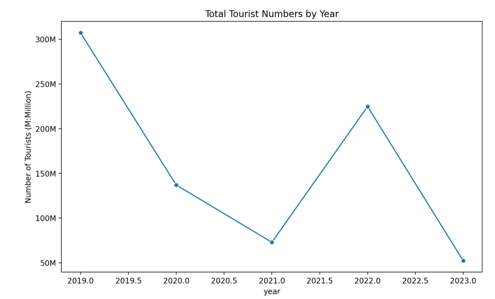

<!-- Project Header -->
# DADS 5001 Final Project: Analyzing Domestic Tourism Insights in Thailand (Jan 2019 to Feb 2022)

## Overview
This project aims to analyze domestic tourism statistics in Thailand from January
2019 to February 2023 using data science techniques. This project will explore
insights related to the number of tourists, occupancy rates, and profits
generated by tourism across different provinces. Additionally, we will categorize
the data by the nationality of tourists, differentiating between Thai and foreign
visitors.

## Usage
Follow these steps to set up and run the project:

1. Create .env file under root folder then add following variable. You can see the varaibles from .env_example file.

```sh
OPENAI_API_KEY=[Your API Key]
```

2. Install dependencies

```sh
pip install python-dotenv
pip install numpy
pip install pandas
pip install matplotlib
python -m pip install -U matplotlib
pip install plotly
pip install seaborn
pip install streamlit
pip install st-annotated-text
pip install statsmodels
pip install --upgrade openai
```

3. Update streamlit to be the latest version

```sh
pip install --upgrade streamlit
```

4. Run the Streamlit server

```sh
streamlit run main.py
```

5. Access the application in your browser at http://localhost:8501.

### Repository Structure

```sh
repository/
├── .env                 
├── .gitignore
├── main.py              # the main function, this is the first file that will be run.
├── aiintegration.py     # the source code for ai integration function that will be shown in 'OpenAI integration' menu.
├── exploratory.py       # the source code for function that will be shown in 'Regional Distribution' and 'Top Performing Provinces' menu.
├── forecast.py          # the source code for insights function that will be shown in 'Covid Recovery: Tourism Trends and Forecast' menu.
├── insights.py     # the source code for insights function that will be shown in 'Covid Analysis Insights (2019-2023)' menu.
├── funct_common.py         # common module to keep common function for this project.
├── funct_preprocessing.py  # this source code for pre processing dataset what will be usned on explortory.
├── funct_visualization.py  # this source code for plot visualization what will be usned on explortory.
├── command-note.txt     # The install dependency command in this project. 
├── data/                # keep original cvs dataset
├── doc/                 # keep foormal document e.g. proposal, poster etc.
├── img/                 # keep immages.

```
## Program Result
### Dataset Menu
Show dataset of Thailand Domestic Tourism 2019-2022


#### Insights
<span style="background-color:rgb(102, 255, 0)">Foreign vs. Domestic Tourists:</span> The presence of separate columns for foreign and Thai tourists indicates the importance of both markets to Thailand's tourism indoustry.

### Regional Distribution Menu
#### Tourists by region data


#### Revenue by region data


#### Region distribution visualization


### Top Performing Provinces Menu
#### Top 10 Provinces by Tourist Numbers
<b>Data</b>


<b>Visualization</b>


#### Top 10 Provinces by Revenue

<b>Data</b>


<b>Visualization</b>


#### Insights
<span style="background-color:rgb(102, 255, 0)">Bangkok Dominance:</span> The capital city is the primary driver of Thailand's domestic tourism, leading in both tourist numbers and revenue generation.

### Covid Analysis Insights (2019-2023) Menu
#### Overall Trends



#### Top 10 Provinces by Tourist Numbers (Latest Year)


#### Recovery Rate Analysis


#### Key Insights
1. The COVID-19 pandemic caused a significant drop in tourist numbers and revenue in 2020 and 2021.

2. A recovery trend is observed starting from 2022, with varying rates across regions.

3. Some regions have shown faster recovery rates than others, potentially due to domestic tourism preferences or local policies.

4. The top provinces by tourist numbers in the latest year may indicate shifting travel patterns post-pandemic.

5. Overall, the tourism industry has not yet fully recovered to pre-pandemic levels, but shows signs of improvement.

#### Recommendations

1. Focus on promoting domestic tourism in regions with slower recovery rates.

2. Investigate successful strategies employed by fast-recovering regions and provinces.

3. Develop targeted marketing campaigns for top-performing provinces to maintain their appeal.

4. Implement safety measures and communicate them effectively to boost traveler confidence.

6. Consider developing new tourism products or experiences that cater to changed traveler preferences post-pandemic.

### Covid Recovery: Tourism Trends and Forecast Menu
This application analyzes historical tourism data from 2019 to 2023 and forecasts trends for 2024–2026.

#### Historical Data (2019–2023)


#### Forecast Data (2024–2026)


#### Tourist Numbers Forecast


#### Revenue Forecast


#### AI Integration Menu
Uses Exponential Smoothing for accurate time-series forecasting.

##### Exponential Smoothing

<span style="background-color:rgb(102, 255, 0)">Exponential Smoothing</span> is a widely used forecasting method for time-series data due to its simplicity, efficiency, and ability to capture trends and seasonality. Here's why it was chosen for the analysis and forecasting of post-pandemic recovery trends in tourist numbers and revenue:

<u>1. Ability to Handle Trends</u>

Exponential Smoothing is particularly effective at capturing trends in time-series data. For the dataset provided, which spans 2019–2023, the data exhibits clear trends influenced by the COVID-19 pandemic (sharp declines in 2020–2021) and subsequent recovery (2022–2023). The method adjusts forecasts based on recent changes, making it suitable for tracking recovery patterns.

<u>2. Flexibility in Model Selection</u>

There are different types of Exponential Smoothing models:
- <span style="background-color:rgb(0, 119, 255);color:white">Simple Exponential Smoothing:</span> For data without a trend or seasonality.

- <span style="background-color:rgb(0, 119, 255);color:white">Holt's Linear Trend Method:</span> For data with a trend (used here for both tourist numbers and revenue).

- <span style="background-color:rgb(0, 119, 255);color:white">Holt-Winters Seasonal Method:</span> For data with both trend and seasonality.

In this case, Holt's method was appropriate because the dataset showed a clear trend but lacked strong seasonality over the years analyzed.

<u>3. Responsiveness to Recent Data</u>

Exponential Smoothing gives more weight to recent observations, making it highly responsive to abrupt changes like those caused by the pandemic. This ensures that the model adapts quickly to shifts in trends during recovery periods, such as the rebound seen in 2022–2023.

<u>4. Simplicity and Interpretability</u>

Compared to more complex machine learning models, Exponential Smoothing is computationally efficient and easy to implement. It provides interpretable results, which are crucial for understanding post-pandemic recovery dynamics.

<u>5. Suitable for Short-Term Forecasting</u>

Exponential Smoothing is ideal for short- to medium-term forecasting (e.g., 2024–2026 in this case). It balances accuracy with simplicity without overfitting the data.

<u>6. Practical Application</u>

The attached charts (Tourist Numbers Forecast and Revenue Forecast) illustrate how Exponential Smoothing has been applied:

- <span style="background-color:rgb(0, 119, 255);color:white">Tourist Numbers Forecast:</span> Shows a declining trend for 2024–2026 after a partial recovery in 2023.

- <span style="background-color:rgb(0, 119, 255);color:white">Revenue Forecast:</span> Reflects similar dynamics, with revenues stabilizing at lower levels compared to pre-pandemic highs.

These forecasts align with real-world expectations, where the tourism sector may face challenges like economic uncertainties or slower-than-expected international travel recovery.

In summary, Exponential Smoothing was chosen because it effectively captures trends, adapts to recent changes, and provides reliable short-term forecasts while being computationally efficient and easy to interpret.

### OpenAI Integration

Integration with OpenAI's GPT-3.5-turbo model for data analysis

#### AI-Powered Insights
1. The central region of Thailand attracts the highest number of tourists, with a total of 354,443,365 tourists. This indicates that the central region is a popular destination for tourists in Thailand.

2. Despite having a lower number of tourists compared to the central region, the south region generates the highest revenue from tourism, with a total revenue of 1,464,082,370,000 baht. This suggests that the south region is able to attract high-spending tourists who contribute significantly to the tourism economy.

3. The number of tourists in Thailand showed a significant decrease in 2020, likely due to the impact of the COVID-19 pandemic on international travel. However, there was a rebound in tourist numbers in 2021 and 2022, indicating a gradual recovery of the tourism industry in Thailand.

4. The east region of Thailand has a relatively low number of tourists compared to other regions, but it generates a significant amount of revenue from tourism. This could be

#### Open AI Interaction


#### Source code explaination

##### Lib

```sh
openai
```

Uses Streamlit's text input function to get information from the keyboard. <span style="background-color:rgb(0, 119, 255);color:white">data</span> variable is DataFrame of dataset that we would like to get insights or foresights.

```sh
user_question = st.text_input("Ask a question about the tourism data:")

prompt = f"You are an assistant that can analyze the following data:\n{data}\nUser: {user_question}\nAssistant:"
```

This prompt is sent to the OpenAI API using the following code:
```sh
response = openai.ChatCompletion.create(
    model="gpt-3.5-turbo",
    messages=[
        {"role": "user", "content": prompt}
    ],
    max_tokens=200,
    n=1,
    stop=None,
    temperature=0.7,
)
```

The API generates a response insights about tourism trends in Thailand based on the provided data.
The response is then displayed in the Streamlit application:

```sh
st.write(response.choices[0].message['content'].strip())
```


